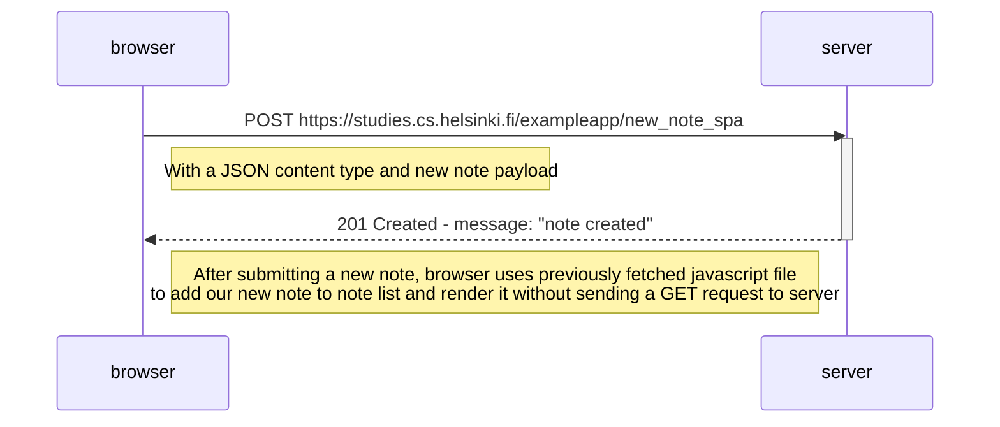

```mermaid
sequenceDiagram
    participant browser
    participant server

    browser->>server: POST https://studies.cs.helsinki.fi/exampleapp/new_note_spa
    activate server
    Note right of browser: With a JSON content type and new note payload

    server-->>browser: 201 Created - message: "note created"
    deactivate server

    Note right of browser: After submitting a new note, browser uses previously fetched javascript file <br> to add our new note to note list and render it without sending a GET request to server

```